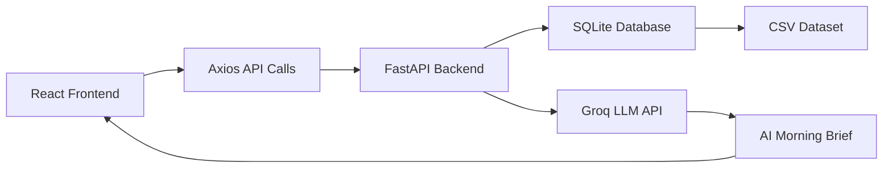

# SwiftServe Operations Intelligence Dashboard

[](https://react.dev/)
[](https://fastapi.tiangolo.com/)
[](https://www.sqlite.org/)
[](https://groq.com/)
[](LICENSE)

> An AI-powered operations intelligence dashboard for SwiftServe, designed to give operations managers a unified view of service health, SLA performance, critical alerts, and ticket risk.

## Overview

SwiftServe Operations Intelligence Dashboard is a modern field service management command center that helps teams monitor operational health in real time. The platform consolidates work orders, technician activity, infrastructure alerts, SLA compliance, and zone-level performance into a single intelligent dashboard.

By combining a React-based frontend with a FastAPI backend and AI-generated summaries through the Groq LLM API, the solution enables faster decision-making and proactive issue handling.

## Problem Statement

Operations managers often rely on disconnected systems to understand:

- Work order status
- Technician performance
- SLA compliance
- Equipment health
- Rising operational risks

This fragmentation makes it difficult to identify issues early and respond quickly.

## Solution

The dashboard provides a centralized operations view with:

- Real-time KPIs
- Critical alert monitoring
- SLA breach visibility
- Tickets-at-risk analysis
- Zone performance insights
- AI-generated morning briefings

## Key Features

### Dashboard Capabilities
- KPI cards for operational health
- Critical alerts panel
- Tickets at risk table
- Zone-level summary charts
- Work orders management view
- AI Morning Brief generation
- Responsive and modern UI

### Backend Features
- KPI Dashboard API
- Alerts API
- Work Orders API
- Open Work Orders API
- Zone Summary API
- SLA Breaches API
- Tickets at Risk API
- AI Morning Brief API

## Tech Stack

### Frontend
- React.js
- Vite
- Axios
- Recharts
- Tailwind CSS

### Backend
- FastAPI
- SQLite Database
- SQLAlchemy

### AI
- Groq LLM API

## Architecture



### AI Flow

```text
Operational Data
      ↓
FastAPI
      ↓
Groq LLM API
      ↓
AI Morning Brief
      ↓
Dashboard
```

## Project Structure

```text
frontend/
├── src/
│   ├── components/
│   ├── pages/
│   ├── services/
│   ├── App.jsx
│   └── main.jsx

backend/
├── app/
│   ├── routes/
│   ├── models/
│   ├── database/
│   ├── services/
│   └── main.py
```

## Data Sources

The dashboard uses the following CSV datasets:

- swiftserve_work_orders.csv
- swiftserve_equipment.csv
- swiftserve_sla_metrics.csv
- swiftserve_technicians.csv
- swiftserve_dispatch_logs.csv

## Getting Started

### Prerequisites

- Python 3.10+
- Node.js 18+
- npm
- A valid Groq API key for AI brief generation

### 1. Backend Setup

From the project root, run:

```powershell
cd backend
python -m venv .venv
.\.venv\Scripts\Activate.ps1
pip install -r requirements.txt
```

Create a `.env` file inside the `backend` folder:

```env
GROQ_API_KEY=your_groq_api_key_here
```

Initialize and seed the database:

```powershell
python create_db.py
python seed_data.py
```

Start the backend server:

```powershell
uvicorn app.main:app --reload
```

The API will be available at:

- http://127.0.0.1:8000
- Swagger Docs: http://127.0.0.1:8000/docs

### 2. Frontend Setup

Open a new terminal and run:

```powershell
cd frontend
npm install
npm run dev
```

The frontend will be available at:

- http://localhost:5173

## API Endpoints

| Method | Endpoint | Description |
|--------|----------|-------------|
| GET | /kpis | Returns key operational KPI metrics |
| GET | /alerts | Returns critical alerts and risk notices |
| GET | /work-orders | Returns all work orders |
| GET | /work-orders/open | Returns currently open work orders |
| GET | /zone-summary | Returns zone-level operational summary |
| GET | /sla-breaches | Returns SLA-risk related work orders |
| GET | /tickets-at-risk | Returns tickets flagged as high risk |
| GET | /morning-brief | Generates an AI-powered morning brief |

## How to Run

1. Start the backend server from the `backend` folder.
2. Start the frontend development server from the `frontend` folder.
3. Open the browser at http://localhost:5173.
4. Explore the dashboard and AI-generated insights.

## Screenshots

### Dashboard Overview


### KPI Cards


### Alerts Panel


### Tickets at Risk


### AI Morning Brief


## Key Achievements

- Real-time operational visibility
- SLA risk detection
- AI-generated executive summaries
- Centralized operations monitoring
- Modern responsive UI

## Future Enhancements

- Predictive maintenance
- Technician route optimization
- Real-time notifications
- User authentication
- Advanced analytics
- Cloud deployment

## Conclusion

SwiftServe Operations Intelligence Dashboard demonstrates how modern web applications, analytics, and AI can transform fragmented operations data into a clear, actionable decision-support experience for service teams.

If you want, this README can also be expanded with a dedicated “Contributing” section, screenshots from your local app, or a license section.
